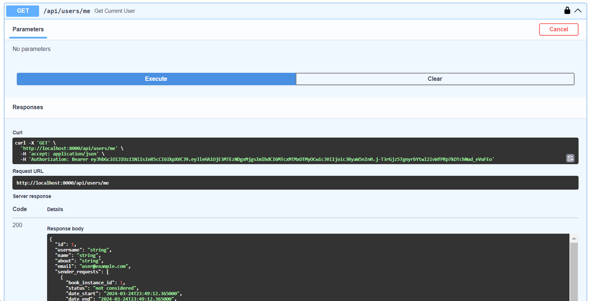
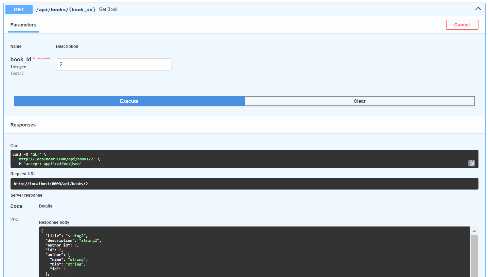

[https://github.com/OleinikovaPolinaStudy/ITMO_ICT_WebDevelopment_tools_2023-2024/tree/laboratory_work_1](https://github.com/OleinikovaPolinaStudy/ITMO_ICT_WebDevelopment_tools_2023-2024/tree/laboratory_work_1)
# Models
## book exchange
```
class StatusType(Enum):
    notconsidered = "not considered"
    accepted = "accepted"
    rejected = "rejected"


class BookExchangeBase(SQLModel):
    book_instance_id: Optional[int] = Field(default=None, foreign_key="bookinstance.id")
    status: StatusType
    date_start: datetime.datetime
    date_end: datetime.datetime


class BookExchange(BookExchangeBase, table=True):
    id: int = Field(default=None, primary_key=True)
    sender_id: Optional[int] = Field(default=None, foreign_key="user.id")
    receiver_id: Optional[int] = Field(default=None, foreign_key="user.id")
    
    sender: Optional["User"] = Relationship(
        back_populates="sender_requests",
        sa_relationship_kwargs=dict(foreign_keys="[BookExchange.sender_id]"),
    )
    receiver: Optional["User"] = Relationship(
        back_populates="receiver_requests",
        sa_relationship_kwargs=dict(foreign_keys="[BookExchange.receiver_id]"),
    )
    book_instance: Optional["BookInstance"] = Relationship(
        back_populates="requests",
        sa_relationship_kwargs=dict(foreign_keys="[BookExchange.book_instance_id]"),
    )


class BookExchangeChangeStatus(SQLModel):
    status: StatusType


class BookExchangeRead(BookExchangeBase):
    id: int 
    sender_id: int
    receiver_id: int


class BookExchangeReadFull(BookExchangeRead):
    sender: "UserBase" = None
    receiver: "UserBase" = None
    book_instance: "BookInstanceWithBook" = None

```
## book instance
```
class BookInstanceBase(SQLModel):
    book_id: Optional[int] = Field(default=None, foreign_key="book.id")
    date: datetime.datetime
    publisher: str
    features: str


class BookInstance(BookInstanceBase, table=True):
    id: int = Field(default=None, primary_key=True)
    owner_id: Optional[int] = Field(default=None, foreign_key="user.id")
    requests: Optional[List["BookExchange"]] = Relationship(
        back_populates="book_instance",
        sa_relationship_kwargs=dict(foreign_keys="[BookExchange.book_instance_id]"),
    )
    book: Optional["Book"] = Relationship(back_populates="instances")    
    owner: Optional["User"] = Relationship(back_populates="instances")  

    
class BookInstanceRead(BookInstanceBase):
    id: int
    owner_id: int
    

class BookInstanceWithBook(BookInstanceRead):
    book: "BookRead" = None
    

class BookInstanceReadFull(BookInstanceWithBook):
    requests: list["BookExchangeRead"] = []
    owner: "UserBase" = None

```
## author
```
class AuthorBase(SQLModel):
    name: str
    bio: str


class Author(AuthorBase, table=True):
    id: int = Field(default=None, primary_key=True)
    books: Optional[List["Book"]] = Relationship(back_populates="author")    


class AuthorRead(AuthorBase):
    id: int
    
    
class AuthorReadFull(AuthorRead):
    books: list["BookRead"] = []

```
## book
```
class BookBase(SQLModel):
    title: str
    description: str
    author_id: Optional[int] = Field(default=None, foreign_key="author.id")


class Book(BookBase, table=True):
    id: int = Field(default=None, primary_key=True)
    author: Optional[Author] = Relationship(back_populates="books")
    owners: Optional[List["User"]] = Relationship(back_populates="books", link_model=BookInstance)
    instances: Optional[List["BookInstance"]] = Relationship(back_populates="book")


class BookRead(BookBase):
    id: int
    
    
class BookReadFull(BookRead):
    author: AuthorRead = None
    owners: list["UserBase"] = []
    instances: list["BookInstanceRead"] = []

```
## user
```
class UserBase(SQLModel):
    id: int = Field(primary_key=True)
    username: str = Field(index=True)
    name: str
    about: str
    email: EmailStr = Field(unique=True, index=True, sa_type=AutoString)
  

class User(UserBase, table=True):
    password: str = Field(max_length=256, min_length=6)
    created_at: datetime.datetime = datetime.datetime.now()
    books: Optional[List["Book"]] = Relationship(back_populates="owners", link_model=BookInstance)    
    sender_requests: Optional[List["BookExchange"]] = Relationship(
        back_populates="sender",
        sa_relationship_kwargs=dict(foreign_keys="[BookExchange.sender_id]"),
    )
    receiver_requests: Optional[List["BookExchange"]] = Relationship(
        back_populates="receiver",
        sa_relationship_kwargs=dict(foreign_keys="[BookExchange.receiver_id]"),
    )
    instances: Optional[List["BookInstance"]] = Relationship(back_populates="owner")
  

class UserReadFull(UserBase):
    sender_requests:  list["BookExchangeRead"] = []
    receiver_requests:  list["BookExchangeRead"] = []
    instances: list["BookInstanceWithBook"] = []
    
    
class UserInput(SQLModel):
    name: str
    about: str
    username: str
    password: str = Field(max_length=256, min_length=6)
    password2: str
    email: EmailStr = Field(unique=True, index=True, sa_type=AutoString)

    @validator('password2')
    def password_match(cls, v, values, **kwargs):
        if 'password' in values and v != values['password']:
            raise ValueError('passwords don\'t match')
        return v


class UserLogin(SQLModel):
    username: str
    password: str
    
    
class UserPassword(SQLModel):
    old_password: str
    new_password: str
```
# Endpointes

## user
```
from fastapi import APIRouter, HTTPException, Depends
from starlette.status import HTTP_201_CREATED
from auth.auth import AuthHandler
from db.connection import get_session
from models import UserInput, User, UserLogin, UserPassword, UserReadFull
from sqlmodel import select


user_router = APIRouter()
auth_handler = AuthHandler()


@user_router.post('/registration', status_code=201, description='Register new user')
def register(user: UserInput, session=Depends(get_session)):
    users = session.exec(select(User)).all()
    if any(x.username == user.username for x in users):
        raise HTTPException(status_code=400, detail='Username is taken')
    if any(x.email == user.email for x in users):
        raise HTTPException(status_code=400, detail='Email is taken')
    hashed_pwd = auth_handler.get_password_hash(user.password)
    user = User(username=user.username, password=hashed_pwd, email=user.email, name=user.name, about=user.about)
    session.add(user)
    session.commit()
    return {"status": 201, "message": "Created"}


@user_router.post('/login')
def login(user: UserLogin, session=Depends(get_session)):
    user_found = session.exec(select(User).where(User.username == user.username)).first()
    if not user_found:
        raise HTTPException(status_code=401, detail='Invalid username and/or password')
    verified = auth_handler.verify_password(user.password, user_found.password)
    if not verified:
        raise HTTPException(status_code=401, detail='Invalid username and/or password')
    token = auth_handler.encode_token(user_found.username)
    return {'token': token}


@user_router.get('/users/me')
def get_current_user(user: User = Depends(auth_handler.get_current_user)) -> UserReadFull:
    return user


@user_router.patch("/users/me/password")
def user_pwd(user_pwd: UserPassword, session=Depends(get_session), current=Depends(auth_handler.get_current_user)):
    found_user = session.get(User, current.id)
    if not found_user:
        raise HTTPException(status_code=404, detail="User not found")
    verified = auth_handler.verify(user_pwd.old_password, found_user.password)
    if not verified:
        raise HTTPException(status_code=400, detail="Invalid old password")
    hashed_pwd = auth_handler.get_password_hash(user_pwd.new_password)
    found_user.password = hashed_pwd
    session.add(found_user)
    session.commit()
    session.refresh(found_user)
    return {"status": 200, "message": "password changed successfully"}


@user_router.get("/users")
def user_list(session=Depends(get_session)) -> list[User]:
    users = session.exec(select(User)).all()
    user_models = [user.model_dump(exclude={'password'}) for user in users]
    return user_models


@user_router.get("/users/{user_id}")
def user_one(user_id: int, session=Depends(get_session)) -> UserReadFull:
    user = session.get(User, user_id)
    if not user:
        raise HTTPException(status_code=404, detail="User not found")
    return user
```

## book
```
from fastapi import APIRouter, HTTPException
from sqlmodel import select
from fastapi import Depends
from models import Book, BookBase, BookReadFull
from db.connection import get_session

book_router = APIRouter()


@book_router.get("/")
def get_books(session=Depends(get_session)) -> list[BookReadFull] :
    return session.exec(select(Book)).all()


@book_router.get("/{book_id}")
def get_book(book_id: int, session=Depends(get_session)) -> BookReadFull:
    book = session.get(Book, book_id)
    if not book:
        raise HTTPException(status_code=404, detail="Book not found")
    return book


@book_router.post("/")
def create_book(book_data: BookBase, session=Depends(get_session)) -> Book:
    book = Book.model_validate(book_data)
    session.add(book)
    session.commit()
    session.refresh(book)
    return book


@book_router.patch("/{book_id}")
def update_book(book_id: int, book_data: BookBase, session=Depends(get_session)) -> Book:
    book = session.exec(select(Book).where(Book.id == book_id)).first()
    if not book:
        raise HTTPException(status_code=404, detail="Book not found")
    for key, value in book_data.model_dump(exclude_unset=True).items():
        setattr(book, key, value)
    session.add(book)
    session.commit()
    session.refresh(book)
    return book


@book_router.delete("/{book_id}")
def delete_book(book_id: int, session=Depends(get_session)):
    book = session.exec(select(Book).where(Book.id == book_id)).first()
    if not book:
        raise HTTPException(status_code=404, detail="Book not found")
    session.delete(book)
    session.commit()
    return {"ok": True}
```

## book instance
```
from fastapi import APIRouter, HTTPException
from sqlmodel import select
from fastapi import Depends
from models import BookInstance, BookInstanceBase, BookInstanceReadFull
from db.connection import get_session
from auth.auth import AuthHandler

book_instance_router = APIRouter()
auth_handler = AuthHandler()


@book_instance_router.get("/")
def get_book_instances(session=Depends(get_session)) -> list[BookInstanceReadFull]:
    return session.exec(select(BookInstance)).all()


@book_instance_router.get("/{book_instance_id}")
def get_book_instance(book_instance_id: int, session=Depends(get_session)) -> BookInstanceReadFull:    
    book_instance = session.get(BookInstance, book_instance_id)
    if not book_instance:
        raise HTTPException(status_code=404, detail="Book instance not found")
    return book_instance


@book_instance_router.post("/")
def create_book_instance(book_instance_data: BookInstanceBase, session=Depends(get_session), current=Depends(auth_handler.get_current_user)) -> BookInstance:
    book_instance = BookInstance.model_validate(book_instance_data)
    book_instance.owner_id = current.id
    session.add(book_instance)
    session.commit()
    session.refresh(book_instance)
    return book_instance


@book_instance_router.patch("/{book_instance_id}")
def update_book_instance(book_instance_id: int, book_instance_data: BookInstanceBase, session=Depends(get_session), current=Depends(auth_handler.get_current_user)) -> BookInstance:
    book_instance = session.exec(select(BookInstance).where(BookInstance.id == book_instance_id)).first()
    if not book_instance:
        raise HTTPException(status_code=404, detail="Book not found")
    if book_instance.owner_id != current.id:
        raise HTTPException(status_code=403, detail="Forbidden")
    for key, value in book_instance_data.model_dump(exclude_unset=True).items():
        setattr(book_instance, key, value)
    session.add(book_instance)
    session.commit()
    session.refresh(book_instance)
    return book_instance


@book_instance_router.delete("/{book_instance_id}")
def delete_book_instance(book_instance_id: int, session=Depends(get_session), current=Depends(auth_handler.get_current_user)):
    book_instance = session.exec(select(BookInstance).where(BookInstance.id == book_instance_id)).first()
    if not book_instance:
        raise HTTPException(status_code=404, detail="Book not found")
    if book_instance.owner_id != current.id:
        raise HTTPException(status_code=403, detail="Forbidden")
    session.delete(book_instance)
    session.commit()
    return {"ok": True}
```

## book exchange
```
from fastapi import APIRouter, HTTPException
from sqlmodel import select
from fastapi import Depends
from models import BookExchange, BookExchangeBase, BookExchangeChangeStatus, BookExchangeReadFull
from db.connection import get_session
from auth.auth import AuthHandler
from models import BookInstance

book_exchange_router = APIRouter()
auth_handler = AuthHandler()


@book_exchange_router.get("/sender")
def get_book_exchanges(session=Depends(get_session), current=Depends(auth_handler.get_current_user)) -> list[BookExchangeReadFull]:
    return session.exec(select(BookExchange).where(BookExchange.sender_id==current.id)).all()


@book_exchange_router.get("/receiver")
def get_book_exchanges(session=Depends(get_session), current=Depends(auth_handler.get_current_user)) -> list[BookExchangeReadFull]:
    return session.exec(select(BookExchange).where(BookExchange.receiver_id==current.id)).all()


@book_exchange_router.get("/{book_exchange_id}")
def get_book_exchange(book_exchange_id: int, session=Depends(get_session)) -> BookExchangeReadFull:    
    book_exchange = session.get(BookExchange, book_exchange_id)
    if not book_exchange:
        raise HTTPException(status_code=404, detail="Book exchange not found")
    return book_exchange


@book_exchange_router.post("/")
def create_book_exchange(book_exchange_data: BookExchangeBase, session=Depends(get_session), current=Depends(auth_handler.get_current_user)) -> BookExchange:
    book_exchange = BookExchange.model_validate(book_exchange_data)
    book_instance = session.get(BookInstance, book_exchange_data.book_instance_id)
    book_exchange.receiver_id = current.id
    book_exchange.sender_id = book_instance.owner_id
    session.add(book_exchange)
    session.commit()
    session.refresh(book_exchange)
    return book_exchange


@book_exchange_router.patch("/{book_exchange_id}")
def update_book_exchange(book_exchange_id: int, book_exchange_data: BookExchangeChangeStatus, session=Depends(get_session), current=Depends(auth_handler.get_current_user)) -> BookExchange:
    book_exchange = session.exec(select(BookExchange).where(BookExchange.id == book_exchange_id)).first()
    if not book_exchange:
        raise HTTPException(status_code=404, detail="Book exchange not found")
    if book_exchange.sender_id!=current.id:
        raise HTTPException(status_code=403, detail="Forbidden")
    book_exchange.status = book_exchange_data.status
    session.add(book_exchange)
    session.commit()
    session.refresh(book_exchange)
    return book_exchange


@book_exchange_router.delete("/{book_exchange_id}")
def delete_book_exchange(book_exchange_id: int, session=Depends(get_session), current=Depends(auth_handler.get_current_user)):
    book_exchange = session.exec(select(BookExchange).where(BookExchange.id == book_exchange_id)).first()
    if not book_exchange:
        raise HTTPException(status_code=404, detail="Book exchange not found")
    if book_exchange.receiver_id!=current.id:
        raise HTTPException(status_code=403, detail="Forbidden")
    session.delete(book_exchange)
    session.commit()
    return {"ok": True}
```

## author
```
from fastapi import APIRouter, HTTPException
from sqlmodel import select
from fastapi import Depends
from models import Author, AuthorBase, AuthorReadFull
from db.connection import get_session

author_router = APIRouter()


@author_router.get("/")
def get_authors(session=Depends(get_session)) -> list[Author]:
    return session.exec(select(Author)).all()


@author_router.get("/{author_id}")
def get_author(author_id: int, session=Depends(get_session)) -> AuthorReadFull:
    author = session.get(Author, author_id)
    if not author:
        raise HTTPException(status_code=404, detail="Author not found")
    return author


@author_router.post("/")
def create_author(author_data: AuthorBase, session=Depends(get_session)) -> Author:
    author = Author.model_validate(author_data)
    session.add(author)
    session.commit()
    session.refresh(author)
    return author


@author_router.patch("/{author_id}")
def update_author(author_id: int, author_data: AuthorBase, session=Depends(get_session)) -> Author:
    author = session.exec(select(Author).where(Author.id == author_id)).first()
    if not author:
        raise HTTPException(status_code=404, detail="Author not found")
    for key, value in author_data.model_dump(exclude_unset=True).items():
        setattr(author, key, value)
    session.add(author)
    session.commit()
    session.refresh(author)
    return author


@author_router.delete("/{author_id}")
def delete_author(author_id: int, session=Depends(get_session)):
    author = session.exec(select(Author).where(Author.id == author_id)).first()
    if not author:
        raise HTTPException(status_code=404, detail="Author not found")
    session.delete(author)
    session.commit()
    return {"ok": True}
```

# DB connection
```
from sqlmodel import SQLModel, Session, create_engine
import os
from dotenv import load_dotenv

load_dotenv()
db_url = os.getenv('DB_ADMIN')
engine = create_engine(db_url, echo=True)
session = Session(bind=engine)


def init_db():
    SQLModel.metadata.create_all(engine)


def get_session():
    with Session(engine) as session:
        yield session
```