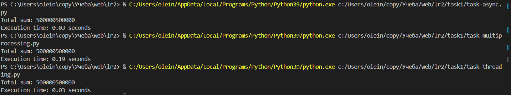
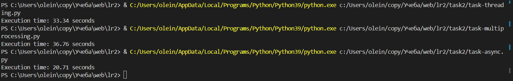
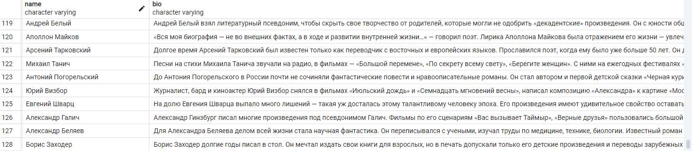

# Task 1

Задача: Напишите три различных программы на Python, использующие каждый из подходов: threading, multiprocessing и async. Каждая программа должна решать считать сумму всех чисел от 1 до 1000000. Разделите вычисления на несколько параллельных задач для ускорения выполнения.

Подробности задания:

1. Напишите программу на Python для каждого подхода: threading, multiprocessing и async.
2. Каждая программа должна содержать функцию calculate_sum(), которая будет выполнять вычисления.
3. Для threading используйте модуль threading, для multiprocessing - модуль multiprocessing, а для async - ключевые слова async/await и модуль asyncio.
4. Каждая программа должна разбить задачу на несколько подзадач и выполнять их параллельно.
5. Замерьте время выполнения каждой программы и сравните результаты.

### async
```
import asyncio
import time


async def calculate_sum(start, end):
    return sum(range(start, end))

async def main():
    start = 1
    end = 1000000
    n_tasks = 4
    step = int(end / n_tasks)

    tasks = []
    for i in range(n_tasks):
        step_start = i * step + start
        step_end = (i + 1) * step + start if i != n_tasks - 1 else end + 1
        task = asyncio.create_task(calculate_sum(step_start, step_end))
        tasks.append(task)

    results = await asyncio.gather(*tasks)
    total_sum = sum(results)
    print("Total sum:", total_sum)

if __name__ == '__main__':
    start_time = time.time()
    asyncio.run(main())
    end_time = time.time()
    print(f"Execution time: {end_time - start_time:.2f} seconds")
```

### threading
```
import threading
import time


def calculate_sum(start, end, result):
    total = sum(range(start, end))
    result.append(total)


def main():
    start = 1
    end = 1000000
    n_threads = 4
    results = [0] * n_threads
    step = int(end / n_threads)

    threads = []    
    for i in range(n_threads):
        step_start = i * step + start
        step_end = (i + 1) * step + start if i != n_threads - 1 else end + 1
        thread = threading.Thread(target=calculate_sum, args=(step_start, step_end, results))
        threads.append(thread)
        thread.start()

    for thread in threads:
        thread.join()

    total_sum = sum(results)
    print(f"Total sum: {total_sum}")


if __name__ == '__main__':
    start_time = time.time()
    main()
    end_time = time.time()
    print(f"Execution time: {end_time - start_time:.2f} seconds")
```

### multiprocessing
```
import multiprocessing
import time


def calculate_sum(start, end, result):
    total = sum(range(start, end))
    result.put(total)


def main():
    start = 1
    end = 1000000
    n_processes = 4
    result_queue = multiprocessing.Queue()
    step = int(end / n_processes)

    processes = []    
    for i in range(n_processes):
        step_start = i * step + start
        step_end = (i + 1) * step + start if i != n_processes - 1 else end + 1
        process = multiprocessing.Process(target=calculate_sum, args=(step_start, step_end, result_queue))
        processes.append(process)
        process.start()

    for process in processes:
        process.join()

    total_sum = sum(result_queue.get() for _ in range(n_processes))
    print(f"Total sum: {total_sum}")


if __name__ == '__main__':
    start_time = time.time()
    main()
    end_time = time.time()
    print(f"Execution time: {end_time - start_time:.2f} seconds")
```
## Результат

| Program      | Time                          |
| ----------- | ------------------------------------ |
| `async`    | 0.03 |
| `threading`       | 0.03 |
| `multiprocessing`       | 0.19 |



1. **Threading (0.03 секунды)**: Использование потоков (threading) для выполнения задачи было достаточно быстрым. Потоки работают в рамках одного процесса, поэтому время затрачивается только на саму задачу.

2. **Multiprocessing (0.19 секунды)**: Многопроцесорность заняла значительно больше времени. Этот подход запускает каждую задачу в своем процессе, что идеально подходит для CPU-интенсивных задач, но из-за накладных расходов на создание процессов и обмен сообщениями между ними может быть менее эффективным для небольших или быстрых задач.

3. **Async (0.03 секунды)**: Асинхронное программирование показало время, сопоставимое с threading, что делает его очень эффективным для этой задачи. Оно позволяет выполнять множество таких задач параллельно без значительных накладных расходов.

# Task 2

Задача: Напишите программу на Python для параллельного парсинга нескольких веб-страниц с сохранением данных в базу данных с использованием подходов threading, multiprocessing и async. Каждая программа должна парсить информацию с нескольких веб-сайтов, сохранять их в базу данных.

Подробности задания:

1. Напишите три различных программы на Python, использующие каждый из подходов: threading, multiprocessing и async.
2. Каждая программа должна содержать функцию parse_and_save(url), которая будет загружать HTML-страницу по указанному URL, парсить ее, сохранять заголовок страницы в базу данных и выводить результат на экран.
3. Используйте базу данных из лабораторной работы номер 1 для заполенния ее данными. Если Вы не понимаете, какие таблицы и откуда Вы могли бы заполнить с помощью парсинга, напишите преподавателю в общем чате потока.
4. Для threading используйте модуль threading, для multiprocessing - модуль multiprocessing, а для async - ключевые слова async/await и модуль aiohttp для асинхронных запросов.
5. Создайте список нескольких URL-адресов веб-страниц для парсинга и разделите его на равные части для параллельного парсинга.
6. Запустите параллельный парсинг для каждой программы и сохраните данные в базу данных.
7. Замерьте время выполнения каждой программы и сравните результаты.

### async
```
import asyncio
import time
import config
import aiohttp
from bs4 import BeautifulSoup
from connection import DataBaseConnection


async def get_bio(session, url):
    async with session.get(url) as response:
        html = await response.text()
        soup = BeautifulSoup(html, 'html.parser')
        text = soup.find('div', class_='xZmPc')
        bio_container = text.find('div')
        if bio_container.em and bio_container.em.text:
            return bio_container.em.text
        if bio_container.text:
            return bio_container.text


async def parse_and_save(url, db_conn):
    try:
        async with aiohttp.ClientSession(connector=aiohttp.TCPConnector(ssl=False)) as session:
            async with session.get(url) as response:
                html = await response.text()
                soup = BeautifulSoup(html, 'html.parser')

                tasks = soup.find_all('div', class_='CHPy6')
                for task in tasks:
                    name = task.find('div', class_='dbENL').text + ' ' + task.find('div', class_='p1Gbz').text
                    bio = await get_bio(session, 'https://www.culture.ru' + task.a['href'])

                    with db_conn.cursor() as cursor:
                            cursor.execute(DataBaseConnection.INSERT_SQL, (name, bio))

                db_conn.commit()
    except Exception as e:
        print("Error:", e)
        
        
async def process_url_list(url_list, conn):
    tasks = []
    for url in url_list:
        task = asyncio.create_task(parse_and_save(url, conn))
        tasks.append(task)
    await asyncio.gather(*tasks)


async def main():
    urls = config.URLS
    num_threads = config.NUM_THREADS
    chunk_size = len(urls) // num_threads
    url_chunks = [urls[i:i + chunk_size] for i in range(0, len(urls), chunk_size)]
    db_conn = DataBaseConnection.connect_to_database()

    await asyncio.gather(*(process_url_list(chunk, db_conn) for chunk in url_chunks))

    db_conn.close()


if __name__ == '__main__':
    start_time = time.time()
    asyncio.set_event_loop_policy(asyncio.WindowsSelectorEventLoopPolicy())
    asyncio.run(main())
    end_time = time.time()
    print(f"Execution time: {end_time - start_time:.2f} seconds") # 20.71
```

### threading
```
import threading
import time
import config
from connection import DataBaseConnection
import requests
from bs4 import BeautifulSoup


def get_bio(url):
    response = requests.get(url)
    html = response.text
    soup = BeautifulSoup(html, 'html.parser')
    text = soup.find('div', class_='xZmPc')
    bio_container = text.find('div')
    if bio_container.em and bio_container.em.text:
        return bio_container.em.text
    if bio_container.text:
        return bio_container.text


def parse_and_save(url, db_conn):
    try:
        response = requests.get(url)
        html = response.text
        soup = BeautifulSoup(html, 'html.parser')

        tasks = soup.find_all('div', class_='CHPy6')
        for task in tasks:
            name = task.find('div', class_='dbENL').text + ' ' + task.find('div', class_='p1Gbz').text
            bio = get_bio('https://www.culture.ru' + task.a['href'])

            with db_conn.cursor() as cursor:
                    cursor.execute(DataBaseConnection.INSERT_SQL, (name, bio))

        db_conn.commit()
    except Exception as e:
        print("Error:", e)
        
        
def process_url_list(url_list, db_conn):
    for url in url_list:
        parse_and_save(url, db_conn)


def main():
    urls = config.URLS
    num_threads = config.NUM_THREADS
    chunk_size = len(urls) // num_threads
    url_chunks = [urls[i:i + chunk_size] for i in range(0, len(urls), chunk_size)]
    db_conn = DataBaseConnection.connect_to_database()
    
    threads = []
    for chunk in url_chunks:
        thread = threading.Thread(target=process_url_list, args=(chunk, db_conn))
        threads.append(thread)
        thread.start()

    for thread in threads:
        thread.join()

    db_conn.close()


if __name__ == '__main__':
    start_time = time.time()
    main()
    end_time = time.time()
    print(f"Execution time: {end_time - start_time:.2f} seconds") # 33.34
```

### multiprocessing
```
import multiprocessing
import time
import config
from connection import DataBaseConnection
import requests
from bs4 import BeautifulSoup


def get_bio(url):
    response = requests.get(url)
    html = response.text
    soup = BeautifulSoup(html, 'html.parser')
    text = soup.find('div', class_='xZmPc')
    bio_container = text.find('div')
    if bio_container.em and bio_container.em.text:
        return bio_container.em.text
    if bio_container.text:
        return bio_container.text


def parse_and_save(url, db_conn):
    try:
        response = requests.get(url)
        html = response.text
        soup = BeautifulSoup(html, 'html.parser')

        tasks = soup.find_all('div', class_='CHPy6')
        for task in tasks:
            name = task.find('div', class_='dbENL').text + ' ' + task.find('div', class_='p1Gbz').text
            bio = get_bio('https://www.culture.ru' + task.a['href'])

            with db_conn.cursor() as cursor:
                    cursor.execute(DataBaseConnection.INSERT_SQL, (name, bio))

        db_conn.commit()
    except Exception as e:
        print("Error:", e)
        
        
def process_url_list(url_list):
    db_conn = DataBaseConnection.connect_to_database()
    for url in url_list:
        parse_and_save(url, db_conn)
    db_conn.close()


def main():
    urls = config.URLS
    num_threads = config.NUM_THREADS
    chunk_size = len(urls) // num_threads
    url_chunks = [urls[i:i + chunk_size] for i in range(0, len(urls), chunk_size)]

    processes = []
    for chunk in url_chunks:
        process = multiprocessing.Process(target=process_url_list, args=(chunk,))
        process.start()
        processes.append(process)

    for process in processes:
        process.join()


if __name__ == '__main__':
    start_time = time.time()
    main()
    end_time = time.time()
    print(f"Execution time: {end_time - start_time:.2f} seconds") # 36.76
```

## Результат

| Program      | Time                          |
| ----------- | ------------------------------------ |
| `async`    | 20.71 |
| `threading`       | 33.34 |
| `multiprocessing`       | 36.76 |





Асинхронное программирование (async) является наиболее эффективным подходом для задачи параллельного парсинга веб-страниц и сохранения данных в базу данных, особенно когда задача включает много I/O операций, таких как запросы к веб-серверам. Подход threading также показал хорошие результаты и может быть предпочтителен для простых задач или когда асинхронное программирование не может быть использовано. Multiprocessing, хотя и может быть полезным для CPU-интенсивных задач, оказался менее эффективным для данной задачи из-за больших накладных расходов на управление процессами.