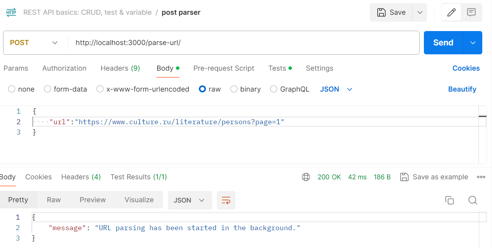
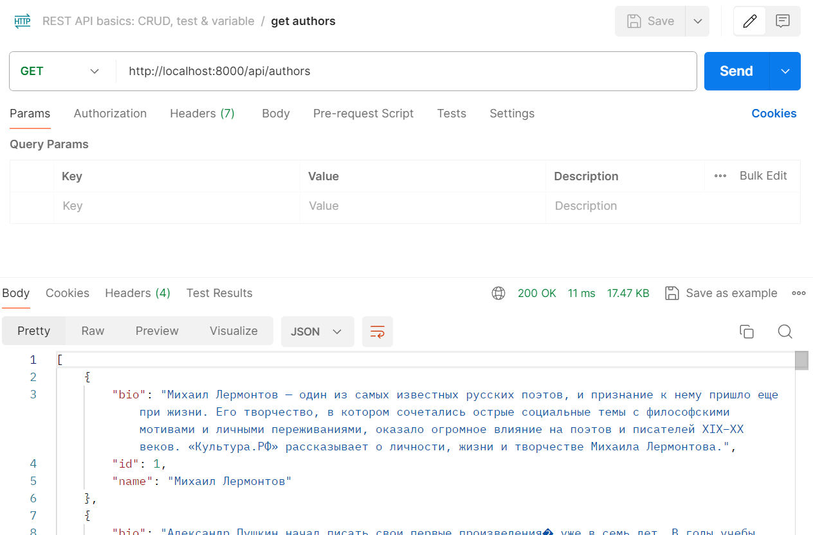

# Лабораторная работа 3: Упаковка FastAPI приложения в Docker, Работа с источниками данных и Очереди

## Описание задания

### Цель
Научиться упаковывать FastAPI приложение в Docker, интегрировать парсер данных с базой данных и вызывать парсер через API и очередь.

Задачи 1 и 2 - задачи на минимум для сдачи - 70% баллов. Задачи 1, 2 и 3 - 100% баллов.

### Подзадача 1: Упаковка FastAPI приложения, базы данных и парсера данных в Docker

Docker — это платформа для разработки, доставки и запуска приложений в контейнерах. Контейнеры позволяют упаковать приложение и все его зависимости в единый образ, который можно запускать на любой системе, поддерживающей Docker, что обеспечивает консистентность среды выполнения и упрощает развертывание. Docker помогает ускорить разработку, повысить гибкость и масштабируемость приложений. Материалы: [Основы работы с Docker]([https://tproger.ru/translations/docker-for-beginners/](https://tproger.ru/translations/how-to-start-using-docker).


1. **Создание FastAPI приложения**:
   Создано в рамках лабораторной работы номер 1

2. **Создание базы данных**:
   Создано в рамках лабораторной работы номер 1

3. **Создание парсера данных**:
   Создано в рамках лабораторной работы номер 2

4. **Реулизуйте возможность вызова парсера по http**
   Для этого можно сделать отдельное приложение FastAPI для парсера или воспользоваться библиотекой socket или подобными.

   Пример кода:
```
from fastapi import FastAPI, HTTPException
...

app = FastAPI()

@app.post("/parse")
def parse(url: str):
    try:
        response = requests.get(url)
        response.raise_for_status()
        # Вызов парсера
        return {"message": "Parsing completed", ...}
    except requests.RequestException as e:
        raise HTTPException(status_code=500, detail=str(e))
```


6. **Разработка Dockerfile**:
   - Необходимо создать Dockerfile для упаковки FastAPI приложения и приложения с паресером. В Dockerfile указать базовый образ, установить необходимые зависимости, скопировать исходные файлы в контейнер и определить команду для запуска приложения.
   - **Зачем**: Docker позволяет упаковать приложение и все его зависимости в единый контейнер, что обеспечивает консистентность среды выполнения и упрощает развертывание.
   - Полезные ссылки:
     - [FastAPI и Docker-контейнеры](https://fastapi.tiangolo.com/ru/deployment/docker/)
     - [Запускаем PostgreSQL в Docker: от простого к сложному](https://habr.com/ru/articles/578744/)
     - - [Документация Dockerfile](https://docs.docker.com/engine/reference/builder/)

7. **Создание Docker Compose файла**:
   - Необходимо написать docker-compose.yml для управления оркестром сервисов, включающих FastAPI приложение, базу данных и парсер данных. Определите сервисы, укажите порты и зависимости между сервисами.
   - **Зачем**: Docker Compose упрощает управление несколькими контейнерами, позволяя вам запускать и настраивать все сервисы вашего приложения с помощью одного файла конфигурации.
   - Полезные ссылки:
     - [Зачем нужны системы оркестрации?](https://rebrainme.com/blog/kubernetes/zachem-nuzhny-sistemy-orkestraczii/)
     - [Developing a FastAPI Application in a Docker Container](https://dev.to/abbazs/developing-a-fastapi-application-in-a-docker-container-31n4)
     - [Документация Docker Compose](https://docs.docker.com/compose/)

### Подзадача 2: Вызов парсера из FastAPI

1. ** Эндпоинт в FastAPI для вызова парсера**:
   - Необходимо добавить в FastAPI приложение ендпоинт, который будет принимать запросы с URL для парсинга **от клиента**, отправлять запрос парсеру (запущенному в отдельном контейнере) и возвращать ответ с результатом **клиенту**.
   - **Зачем**: Это позволит интегрировать функциональность парсера в ваше веб-приложение, предоставляя возможность пользователям запускать парсинг через API.
   - Полезные ссылки:
     - [Документация FastAPI](https://fastapi.tiangolo.com/tutorial/path-params/)

### Подзадача 3: Вызов парсера из FastAPI через очередь

### Как это работает

1. **Celery и Redis**:
   - Celery — это асинхронная очередь задач, которая позволяет легко распределять и выполнять задачи в фоне. Redis используется как брокер сообщений, хранящий задачи, которые должны быть выполнены.
   - При получении HTTP-запроса, задача ставится в очередь Redis, и Celery-воркер обрабатывает её в фоне.

2. **Docker Compose**:
   - Docker Compose позволяет легко настроить и запустить Celery, Redis и ваше FastAPI приложение как отдельные контейнеры, работающие в одной сети. Это упрощает управление зависимостями и конфигурацией всех компонентов системы.

### Почему это важно для студентов

Практические навыки настройки и использования асинхронной очереди задач в реальном приложении - **первый шаг для MLops для 45 направления**. Студенты научатся разделять ответственность между различными сервисами и компоновать их для достижения общей цели. В реальных проектах часто требуется выполнение сложных и длительных операций. Опыт работы с Celery и Redis подготовит к решению таких задач и даст уверенность в использовании современных технологий.
 
### Задание

1. **Установить Celery и Redis**:
   - Необходимо добавить зависимости для Celery и Redis в проект. Celery будет использоваться для обработки задач в фоне, а Redis будет выступать в роли брокера задач и хранилища результатов.
   - **Зачем**: Celery и Redis позволяют организовать фоновую обработку задач, что полезно для выполнения длительных или ресурсоемких операций без блокировки основного потока выполнения.
   - Полезные ссылки:
     - [Celery: проясняем неочевидные моменты](https://habr.com/ru/articles/686820/)
     - [Документация Celery](https://docs.celeryproject.org/en/stable/)
     - [Документация Redis](https://redis.io/documentation)

2. **Настроить Celery**:
   - необходимо создать файл конфигурации для Celery. Определть задачу для парсинга URL, которая будет выполняться в фоновом режиме.
   - **Зачем**: Настройка Celery позволит асинхронно обрабатывать задачи, что улучшит производительность и отзывчивость вашего приложения.
   - Полезные ссылки:
     - [Документация Celery: Настройка](https://docs.celeryproject.org/en/stable/userguide/configuration.html)

3. **Обновить Docker Compose файл**:
   - Необходимо добавить сервисы для Redis и Celery worker в docker-compose.yml. Определите зависимости между сервисами, чтобы обеспечить корректную работу оркестра.
   - **Зачем**: Это позволит вам легко управлять всеми сервисами вашего приложения, включая асинхронную обработку задач, с помощью одного файла конфигурации.
   - Полезные ссылки:
     - [Документация Docker Compose](https://docs.docker.com/compose/)

4. **Эндпоинт для асинхронного вызова парсера**:
   - Необходимо добавить в FastAPI приложение маршрут для асинхронного вызова парсера. Маршрут должен принимать запросы с URL для парсинга, ставить задачу в очередь с помощью Celery и возвращать ответ о начале выполнения задачи.
   - **Зачем**: Это позволит запускать парсинг веб-страниц в фоне, что улучшит производительность и пользовательский опыт вашего приложения.
   - Полезные ссылки:
     - [Документация FastAPI: Фоновая задачи](https://fastapi.tiangolo.com/tutorial/background-tasks/)

## Выполнение

## Упаковка rest

Dockerfile
```
FROM python:3.9.19-alpine3.20

WORKDIR /app

COPY requirements.txt .

RUN pip install --no-cache-dir --upgrade -r requirements.txt

COPY . .

EXPOSE 8000

CMD ["uvicorn", "main:app", "--host", "0.0.0.0", "--port", "8000"]
```

FROM python:3.9.19-alpine3.20 Эта строка указывает базовый образ для Docker образа.

WORKDIR /app Эта команда устанавливает рабочую директорию внутри контейнера Docker в /app. Все последующие команды будут выполняться в этой директории.

COPY requirements.txt . Эта команда копирует файл requirements.txt из текущей директории на вашем компьютере в текущую рабочую директорию контейнера Docker (/app).

RUN pip install --no-cache-dir --upgrade -r requirements.txt Эта команда запускает установку зависимостей Python, указанных в файле requirements.txt, используя пакетный менеджер pip. Флаг --no-cache-dir предотвращает сохранение временных файлов установки, что уменьшает размер конечного образа Docker. Флаг --upgrade обновляет все пакеты до последних версий, если это возможно.

COPY . . Эта команда копирует все файлы и директории из текущей директории на вашем компьютере в текущую рабочую директорию контейнера Docker (/app).

EXPOSE 8000 Эта команда указывает Docker, что контейнер будет прослушивать порт 8000. Это не открывает порт, но позволяет другим разработчикам понимать, какой порт используется.

CMD ["uvicorn", "main:app", "--host", "0.0.0.0", "--port", "8000"] Эта команда указывает, что нужно выполнить при запуске контейнера. В данном случае, это запуск сервера uvicorn с приложением, определенным в файле main.py.

requirements
```
fastapi
uvicorn
pydantic
sqlmodel
passlib
requests
pyjwt
starlette
sqlalchemy
psycopg2-binary
python-dotenv
httpx
```

## Упаковка парсера

### celery_worker
```
from celery_app import celery_app

if __name__ == "__main__":
    celery_app.start()
```
Запускаем celery

### celery_app
```
from celery import Celery

celery_app = Celery(
    "worker",
    broker="redis://redis:6379/0",
    backend="redis://redis:6379/0",
)

celery_app.conf.update(
    task_routes={
        "tasks.parse_url_task": "main-queue",
    },
)
```
Инициализируем Celery приложение с именем worker и настраиваем его для использования Redis как брокера и backend. Также обновляем конфигурацию Celery для маршрутизации задачи parse_url_task в main-queue.

### tasks
```
import requests
from bs4 import BeautifulSoup
from celery_app import celery_app
from connection import DataBaseConnection


def get_bio(url):
    response = requests.get(url)
    html = response.text
    soup = BeautifulSoup(html, 'html.parser')
    text = soup.find('div', class_='xZmPc')
    bio_container = text.find('div')
    if bio_container.em and bio_container.em.text:
        return bio_container.em.text
    if bio_container.text:
        return bio_container.text

@celery_app.task
def parse_url_task(url: str):
    response = requests.get(url)
    response.raise_for_status()
    html = response.text
    soup = BeautifulSoup(html, 'html.parser')
    db_conn = DataBaseConnection.connect_to_database()

    tasks = soup.find_all('div', class_='CHPy6')
    for task in tasks:
        name = task.find('div', class_='dbENL').text + ' ' + task.find('div', class_='p1Gbz').text
        bio = get_bio('https://www.culture.ru' + task.a['href'])

        with db_conn.cursor() as cursor:
                cursor.execute(DataBaseConnection.INSERT_SQL, (name, bio))

    db_conn.commit()
```
Определяем задачу Celery parse_url_task, которая парсит страницу и записывает авторов в базу данных.

### main
```
from fastapi import FastAPI, BackgroundTasks
from pydantic import BaseModel
from tasks import parse_url_task

app = FastAPI()

class URLItem(BaseModel):
    url: str

@app.post("/parse-url/")
async def parse_url(item: URLItem, background_tasks: BackgroundTasks):
    background_tasks.add_task(parse_url_task, item.url)
    return {"message": "URL parsing has been started in the background."}


@app.get("/")
async def read_root():
    return {"message": "Welcome to the URL parser API!"}
```
Создаем экземпляр класса FastAPI. Определяем модель Pydantic для проверки входящих данных URL. Определяем POST конечную точку /parse-url/, которая принимает URL и запускает фоновую задачу для его анализа. Определяем корневую GET конечную точку /, которая возвращает приветственное сообщение.

### Dockerfile
```
FROM python:3.9.19-alpine3.20

WORKDIR /app

COPY requirements.txt .

RUN pip install --no-cache-dir --upgrade -r requirements.txt

COPY . .

EXPOSE 3000

CMD ["uvicorn", "main:app", "--host", "0.0.0.0", "--port", "3000"]
```
Аналогично rest

### requirements
```
fastapi
uvicorn
pydantic
celery
redis
requests
bs4
psycopg2-binary
python-dotenv
```

## docker-compose
```
version: '3.9'

services:
  celery_app:
    build:
      context: ./celery
      dockerfile: Dockerfile
    container_name: celery
    restart: always
    ports:
      - "3000:3000"
    env_file:
      - .env
    depends_on:
      - redis

  celery_worker:
    build:
      context: ./celery
    container_name: celery_worker
    command: celery -A celery_worker worker --loglevel=info
    restart: always
    depends_on:
      - redis
      - celery_app

  redis:
    image: redis:7.2.4
    container_name: redis
    ports:
      - "6379:6379"
    restart: always

  rest:
    build: ./rest
    container_name: rest
    ports:
      - "8000:8000"
    env_file:
      - ./rest/.env
    depends_on:
      - db
      - celery_app

  db:
    image: postgres:latest
    container_name: db
    ports:
      - "5432:5432"
    environment:
      POSTGRES_USER: ${DB_USER}
      POSTGRES_PASSWORD: ${DB_PASS}
      POSTGRES_DB: ${DB_NAME}
    volumes:
      - postgres_data:/var/lib/postgresql/data

volumes:
  postgres_data:
```

Этот код представляет собой файл **docker-compose.yml**, который используется для определения и запуска многоконтейнерного приложения с использованием Docker Compose. Давайте разберемся, что происходит в каждой строке кода.

**version: '3.9'**

* Указывает версию Docker Compose, которую нужно использовать для интерпретации файла.  Версия 3.9 гарантирует, что все функции и возможности Docker Compose, которые используются в файле, будут корректно интерпретированы.

**services:**

* Этот раздел определяет отдельные сервисы, которые составляют ваше приложение. В данном случае у вас 6 сервисов: `celery_app`, `celery_worker`, `redis`, `rest`, `db`, каждый из которых представляет отдельный контейнер Docker.

**celery_app:**

* **build:**
    * **context: ./celery:** Указывает на директорию, где расположен файл Dockerfile для построения образа этого сервиса.
    * **dockerfile: Dockerfile:**  Определяет имя Dockerfile, которое используется для построения образа.
* **container_name: celery:** Задает имя контейнера.
* **restart: always:** Контейнер будет автоматически перезапускаться при сбое.
* **ports:**
    * **"3000:3000"**:  Перенаправляет порт 3000 из контейнера на порт 3000 на хост-машине, позволяя доступ к сервису извне.
* **env_file:**
    * **- .env:** Использует файл `.env` для загрузки переменных окружения в контейнер.
* **depends_on:**
    * **- redis:** Определяет, что сервис `celery_app` зависит от сервиса `redis`. Это означает, что контейнер `celery_app` будет запущен только после того, как контейнер `redis` будет запущен и готов к работе.

**celery_worker:**

* **build:**
    * **context: ./celery:**  Использует тот же Dockerfile, что и сервис `celery_app`, чтобы построить образ.
* **container_name: celery_worker:**  Название контейнера.
* **command: celery -A celery_worker worker --loglevel=info:** Определяет команду, которую нужно выполнить при запуске контейнера. В данном случае это запуск Celery worker с определенными настройками.
* **restart: always:**  Контейнер перезапускается при сбое.
* **depends_on:**
    * **- redis:**  Этот сервис зависит от `redis`.
    * **- celery_app:**  Также зависит от `celery_app`,  что логично, так как для работы worker-а требуется Celery app.

**redis:**

* **image: redis:7.2.4:** Использует готовый Docker образ `redis:7.2.4`  для запуска Redis сервера.
* **container_name: redis:**  Название контейнера.
* **ports:**
    * **"6379:6379"**: Перенаправление портов.
* **restart: always:**  Автоматический перезапуск.

**rest:**

* **build:**
    * **./rest:**  Использует Dockerfile из директории `rest` для построения образа.
* **container_name: rest:**  Название контейнера.
* **ports:**
    * **"8000:8000"**:  Перенаправление портов.
* **env_file:**
    * **- ./rest/.env:**  Используется файл `.env` для загрузки переменных окружения для сервиса `rest`.
* **depends_on:**
    * **- db:**  Зависит от сервиса `db`.
    * **- celery_app:** Зависит от сервиса `celery_app`.

**db:**

* **image: postgres:latest:**  Использует  образ  `postgres:latest` для запуска PostgreSQL сервера.
* **container_name: db:**  Название контейнера.
* **ports:**
    * **"5432:5432"**: Перенаправление портов.
* **environment:**
    * **POSTGRES_USER: ${DB_USER}**:  Устанавливает имя пользователя  PostgreSQL из переменной окружения  `DB_USER`.
    * **POSTGRES_PASSWORD: ${DB_PASS}**:  Устанавливает  пароль  из  переменной `DB_PASS`.
    * **POSTGRES_DB: ${DB_NAME}**:  Устанавливает имя базы данных  из переменной `DB_NAME`.
* **volumes:**
    * **- postgres_data:/var/lib/postgresql/data:**  Определяет volume `postgres_data`, который будет монтироваться в директорию `/var/lib/postgresql/data` в контейнере `db`. Это позволит сохранять данные базы данных даже после остановки контейнера.

**volumes:**

* **postgres_data:**  Определяет volume, который используется для хранения данных базы данных PostgreSQL.

**В целом, этот код:**

* Определяет 6 сервисов, каждый из которых представляет собой отдельный контейнер Docker.
* Устанавливает зависимости между сервисами, обеспечивая корректный запуск.
* Перенаправляет порты, чтобы сервисы были доступны извне.
* Загружает переменные окружения из файлов `.env`.
* Использует volumes для сохранения данных.


## Результат

